# Artemis Cluster

Repo to track my setup and deployment of my K3S Cluster. This is in no ways "ideal" or "production ready" but it works for me

---


## Pre-Setup

#### Proxmox

Create 5 nodes, we'll be doing 3 control planes with etcd and 2 agents

Current setup is as follows:

Node | Hostname | Static IP
---|---|---
01| k3s01 | 10.10.99.201
02| k3s02 | 10.10.99.202
03| k3s03 | 10.10.99.203
04| k3s04 | 10.10.99.204
05| k3s05 | 10.10.99.205

##### NODE PREP

````bash
sudo qm create 8000 --name "ubuntu-cloudinit" --ostype l26 \
    --memory 1024 \
    --agent 1 \
    --bios ovmf --machine q35 --efidisk0 local-ceph-01:0,pre-enrolled-keys=0 \
    --cpu host --socket 1 --cores 1 \
    --vga serial0 --serial0 socket  \
    --net0 virtio,bridge=vmbr0

sudo qm importdisk 8000 mantic-server-cloudimg-amd64.img local-ceph-01
sudo qm set 8000 --scsihw virtio-scsi-pci --virtio0 local-ceph-01:vm-8000-disk-1,discard=on
sudo qm set 8000 --boot order=virtio0
sudo qm set 8000 --ide2 local-ceph-01:cloudinit

sudo qm set 8000 --cicustom "vendor=local:snippets/vendor.yaml"
sudo qm set 8000 --tags template,23.10,cloudinit,ubuntu
sudo qm set 8000 --ciuser root
sudo qm set 8000 --cipassword $(openssl passwd -6 $CLEARTEXT_PASSWORD)
sudo qm set 8000 --sshkeys ~/.ssh/authorized_keys
sudo qm set 8000 --ipconfig0 ip=dhcp

qm clone 8000  201 --name k3s-02 --full
qm clone 8000  202 --name k3s-02 --full
qm clone 8000  203 --name k3s-03 --full
qm clone 8000  204 --name k3s-04 --full
qm clone 8000  205 --name k3s-05 --full

qm resize 201 virtio0 +12.5G
qm resize 202 virtio0 +12.5G
qm resize 203 virtio0 +12.5G
qm resize 204 virtio0 +12.5G
qm resize 205 virtio0 +12.5G
````

Created a cloud init drive and set some parametes so we could clone the drives. Gave each node 16GB

###### TODO

- use ansible for node setup

###### NOTE

On one of the nodes there was issues pinging so ran the following:

`````bash
cd /var/lib/dpkg/info/ && sudo apt install --reinstall $(grep -l 'setcap' * | sed -e 's/\.[^.]*$//g' | sort --unique)
``````

#### Pfsense

- Register IP 10.10.99.4 under the LAB VLAN as a VIP
- Create 5 static IPs based on the MAC address of the above

#### TrueNAS

see storage/Readme.md

## Setup

Setting up the 3 control planes with etcd and 2 agents in one cluster

On Node 01 (K3S-01) run the following

`openssl rand -hex 10 > k3s_secret.txt`

You will need to copy that file or create it on each node and copy the contents over.

##### First Server Prep

````bash
curl -sfL https://get.k3s.io | K3S_TOKEN=`cat k3s_secret.txt` sh -s - server \
--cluster-init \
--flannel-backend=none \
--disable-kube-proxy \
--disable servicelb \
--disable-network-policy \
--disable traefik \
--cluster-init
````

##### Additional Control Planes

````bash
curl -sfL https://get.k3s.io | K3S_TOKEN=`cat k3s_secret.txt` sh -s - server \
--server https://10.10.99.201:6443 \
--flannel-backend=none \
--disable-kube-proxy \
--disable servicelb \
--disable-network-policy \
--disable traefik \
--cluster-init
````

Agents

````bash
curl -sfL https://get.k3s.io | K3S_TOKEN=`cat k3s_secret.txt` sh -s - agent \
--server https://10.10.99.201:6443
````

## Post-Setup

`kubectl apply -f https://raw.githubusercontent.com/metallb/metallb/v0.14.4/config/manifests/metallb-native.yaml`

Apply networking in the following order

1.      metallb (README exists)
2.      traefik (to override some default values)
3.      ingress and cert manager, read README  there to make sure you're good

TODO

COMPLETE | TASK
---|---
FALSE| move secrets out of files and into its own secrets.yaml/ .env
FALSE| redeploy all iceboxed apps
FALSE| commit to github all the changes since years ago


Deployment Checklist

-
- Persistent Volume Claim has suffix "-pvc"
- Service has suffix "-pvc"
- Ingress Route has suffix "-ing-r

Apps Checklist

APP         |DE-ICED    |DEPLOYMENT | PVC   | Service   | Ingress Route
---         |---        |---        |---    |---        |---
grafana     | NEW       | TRUE      | TRUE  | TRUE      | TRUE
nginx       | NEW       | FALSE     | FALSE | FALSE     | FALSE
nzbhydra2   | NEW       | FALSE     | FALSE | FALSE     | FALSE
overseer    | NEW       | FALSE     | FALSE | FALSE     | FALSE
plex        | TRUE      | FALSE     | FALSE | FALSE     | FALSE
radarr      | TRUE      | FALSE     | FALSE | FALSE     | FALSE
sabnzbd     | TRUE      | FALSE     | FALSE | FALSE     | FALSE
deluge      | FALSE     | FALSE     | FALSE | FALSE     | FALSE
duskbot     | FALSE     | FALSE     | FALSE | FALSE     | FALSE
jackett     | FALSE     | FALSE     | FALSE | FALSE     | FALSE
minecraft   | FALSE     | FALSE     | FALSE | FALSE     | FALSE
tautulli    | FALSE     | FALSE     | FALSE | FALSE     | FALSE
unifi       | FALSE     | FALSE     | FALSE | FALSE     | FALSE
unmanic     | FALSE     | FALSE     | FALSE | FALSE     | FALSE

External App Ingress Routes

APP         | ROUTED
---         |---
HAOS        | FALSE
PIHOLE      | TRUE
UNIFI       | TRUE
PVE         | FALSE
PFSENSE     | FALSE
TRUENAS     | TRUENAS
DELL SW     | FALSE
MIKROTIK    | FALSE

```mermaid

graph TD;

initial>K: Init] -->  k-ac>K: artemis-cluster];
initial>K: Init] -->  k-cm>K: cert-manager];
initial>K: Init] -->  k-dc>K: democratic-csi];
initial>K: Init] -->  k-fs>K: flux-system];
initial>K: Init] -->  k-ext-secrets>K: external-secrets];
initial>K: Init] -->  k-ks>K: kube-system];
initial>K: Init] -->  k-ext-svc>K: external-services];
initial>K: Init] -->  k-ms>K: metallb-sytem];

k-ac>K: artemis-cluster] -->  k-atlas-nfs>K: atlas-nfs];
k-ac>K: artemis-cluster] -->  k-homepage>K: homepage];
k-ac>K: artemis-cluster] -->  k-nzbhydra2>K: nzbhydra2];
k-ac>K: artemis-cluster] -->  k-overseerr>K: overseerr];
k-ac>K: artemis-cluster] -->  k-radarr>K: radarr];
k-ac>K: artemis-cluster] -->  k-sabnzbd>K: sabnzbd];
k-ac>K: artemis-cluster] -->  k-sonarr>K: sonarr];

k-cm>K: cert-manager] ------->  k-cm-app>K: cert-manager app];
k-cm>K: cert-manager] -->  k-cm-issuers>K: issuers];

k-cm>K: cert-manager] -->  k-cm-certs>K: cert-manager certs];
k-cm-issuers>K: issuers] --> |Depends on| k-cm-app>K: cert-manager app]
k-cm-certs>K: certs] --> |Depends on| k-cm-issuers>K: issuers]
k-cm-certs>K: certs] --> |Depends on| k-ks-reflector>K: Reflector]

k-dc>K: democratic-csi] -->  k-dc-appdata(K: democratic-csi app);

k-ext-secrets>K: external-secrets] -->  k-ext-secrets-app>K: App];
k-ext-secrets>K: external-secrets] -->  k-ext-secrets-bw>K: Bitwarden-ESO];

k-ext-secrets-bw>K: Bitwarden-ESO] -->  k-ext-secrets-bw-app>K: Bitwarden-ESO-App];
k-ext-secrets-bw>K: Bitwarden-ESO] -->  k-ext-secrets-bw-pre>K: Bitwarden-ESO-Pre];
k-ext-secrets-bw>K: Bitwarden-ESO] -->  k-ext-secrets-bw-secrets>K: Bitwarden-ESO-Secrets];
k-ext-secrets-bw>K: Bitwarden-ESO] -->  k-ext-secrets-bw-stores>K: Bitwarden-ESO-Stores];

k-ext-secrets-bw-pre>K: Bitwarden-ESO-Pre] --> |Depends on| k-ext-secrets-app>K: App]
k-ext-secrets-bw-app>K: Bitwarden-ESO-App] --> |Depends on| k-ext-secrets-bw-pre>K: Bitwarden-ESO-Pre]
k-ext-secrets-bw-secrets>K: Bitwarden-ESO-Secrets] --> |Depends on| k-ext-secrets-bw-stores>K: Bitwarden-ESO-Stores]
k-ext-secrets-bw-stores>K: Bitwarden-ESO-Stores] --> |Depends on| k-ext-secrets-bw-app>K: Bitwarden-ESO-App]

k-ext-svc>K: external-services] -->  external(External App Routing);
k-ext-svc>K: external-services] --> |Depends on| k-ks-traefik>K: Traefik]
k-ext-svc>K: external-services] --> |Depends on| k-ms-config>K: metallb-sytem-config]
k-ext-svc>K: external-services] --> |Depends on| k-cm-certs>K: certs]

k-fs>K: flux-system] -->  k-fs-capacitor(H: Capacitor);
k-fs>K: flux-system] -->  helm(Import Helm)

k-ks>K: kube-system] ------->  k-ks-traefik>K: Traefik]
k-ks>K: kube-system] -->  k-ks-traefik-dash>K: Traefik Dash]
k-ks>K: kube-system] -->  k-ks-reflector>K: Reflector]
k-ks>K: kube-system] -->  k-ks-reloader>K: Reloader]

k-ks-traefik-dash>K: Traefik Dash] --> |Depends on| k-ks-traefik>K: Traefik]

k-ms>K: metallb-sytem] --> k-ms-app>K: metallb-sytem-app]
k-ms>K: metallb-sytem] --> k-ms-config>K: metallb-sytem-config]

k-ms-config>K: metallb-sytem-config] ---> |Depends on| k-ms-app>K: metallb-sytem-app];
```

