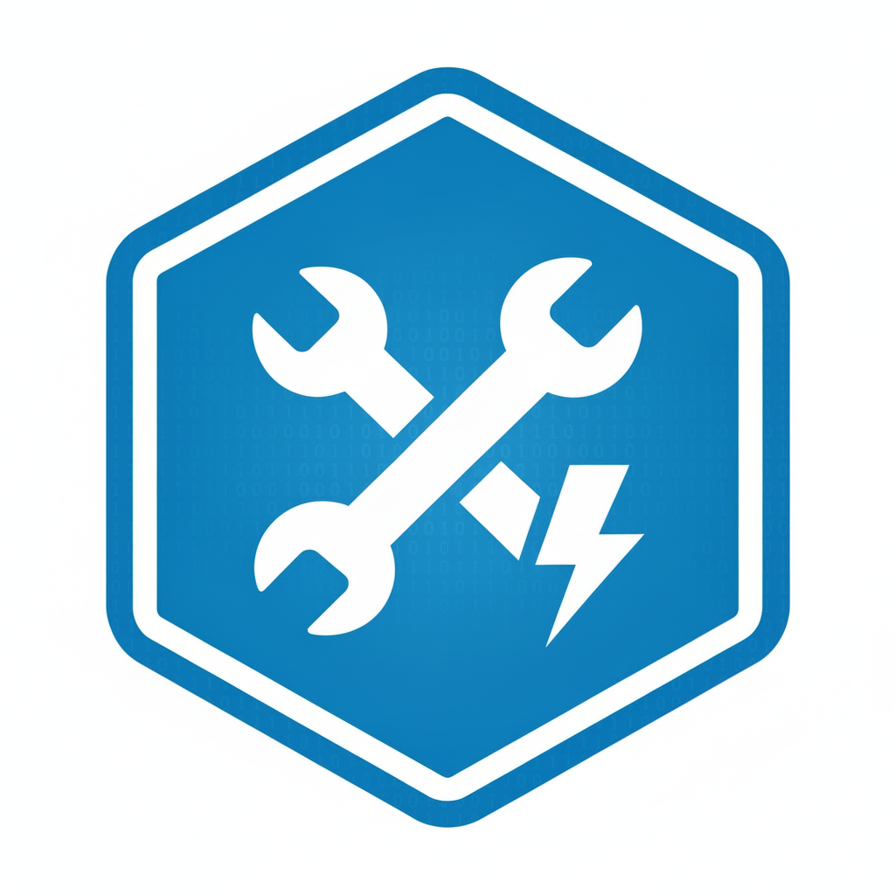

<div align="center">



### The Artemis Cluster! :octocat:

_... where YAML is law, Renovate never sleeps, and 2am is just debugging hours._

</div>

<div align="center">

[](https://www.talos.dev/)&nbsp;&nbsp;
[](https://kubernetes.io/)&nbsp;&nbsp;
[](https://fluxcd.io)&nbsp;&nbsp;
[](https://github.com/Exikle/Artemis-Cluster/actions/workflows/renovate.yaml)

</div>

<div align="center">

[](https://status.dcunha.io)&nbsp;&nbsp;
[](https://status.dcunha.io)&nbsp;&nbsp;
[](https://status.dcunha.io)

</div>

<div align="center">

[](https://github.com/kashalls/kromgo)&nbsp;&nbsp;
[](https://github.com/kashalls/kromgo)&nbsp;&nbsp;
[](https://github.com/kashalls/kromgo)&nbsp;&nbsp;
[](https://github.com/kashalls/kromgo)&nbsp;&nbsp;
[](https://github.com/kashalls/kromgo)&nbsp;&nbsp;
[](https://github.com/kashalls/kromgo)

<!-- [](https://github.com/kashalls/kromgo)&nbsp;&nbsp; -->

[](https://github.com/kashalls/kromgo)

</div>

---

## 📖 Overview

This repository manages my homelab Kubernetes cluster built on [TalosOS](https://www.talos.dev/), following Infrastructure as Code (IaC) and GitOps practices. The setup consists of three bare-metal control plane nodes and three VM workers (including one GPU worker), with all configurations version-controlled and automatically deployed via [FluxCD](https://fluxcd.io/).

I didn't start from a cluster template — this was built from the ground up, learning as I went. Over time I've gradually aligned the structure and conventions with what the [Home Operations](https://discord.gg/home-operations) community has collectively settled on, borrowing ideas and patterns from repos I admire rather than forking from any single starting point.

---

## ⛵ Kubernetes

### Components Explained

The cluster is organized into logical namespaces for maintainability and separation of concerns:

- **kube-system:** The foundation layer — cluster networking ([Cilium](https://cilium.io/)), core DNS ([CoreDNS](https://coredns.io/)), multi-network ([Multus](https://github.com/k8snetworkplumbingwg/multus-cni)), GPU support ([intel-gpu-resource-driver](https://github.com/intel/intel-resource-drivers-for-kubernetes)), and cluster utilities (reloader, reflector, descheduler, spegel).
- **network:** Ingress via [Envoy Gateway](https://gateway.envoyproxy.io/), DNS automation via [ExternalDNS](https://github.com/kubernetes-sigs/external-dns) (Cloudflare + UniFi), and Cloudflare Tunnel.
- **cert-manager:** Automated TLS certificates via Let's Encrypt.
- **observability:** Full monitoring stack — [Prometheus](https://prometheus.io/), [Grafana](https://grafana.com/), [Victoria Logs](https://victoriametrics.com/products/victorialogs/), [Fluent Bit](https://fluentbit.io/), [Gatus](https://github.com/TwiN/gatus), [Kromgo](https://github.com/kashalls/kromgo), KEDA, and UniFi Poller.
- **rook-ceph / openebs-system / volsync-system:** Block storage, local storage, and PVC backup/restore.
- **home-automation:** Home Assistant, Frigate, ESPHome, Zigbee2MQTT, Mosquitto, Matter Server, Homebridge, Node-RED.
- **media:** Full arr stack, Jellyfin, download clients, and supporting tooling.
- **external-secrets:** Secrets from [1Password Connect](https://developer.1password.com/docs/connect/), plus age-encrypted bootstrap secrets.

### Directories

This Git repository contains the following directories under [Kubernetes](./kubernetes/).

```sh
📁 kubernetes
├── 📁 apps
│   ├── 📁 actions-runner-system  # Self-hosted GitHub runners
│   ├── 📁 cert-manager           # TLS certificate management
│   ├── 📁 external-endpoints     # ExternalName services for off-cluster resources
│   ├── 📁 external-secrets       # 1Password Connect secrets provider
│   ├── 📁 flux-system            # Flux Operator + FluxInstance
│   ├── 📁 home-automation        # Home Assistant, Frigate, ESPHome, Zigbee, etc.
│   ├── 📁 kube-system            # Cilium, CoreDNS, Multus, GPU driver, utilities
│   ├── 📁 media                  # Arr stack, Jellyfin, download clients
│   ├── 📁 network                # Envoy Gateway, ExternalDNS, Cloudflare Tunnel
│   ├── 📁 observability          # Prometheus, Grafana, Victoria Logs, Gatus, Kromgo
│   ├── 📁 openebs-system         # Local storage provisioner
│   ├── 📁 rook-ceph              # Distributed block storage
│   ├── 📁 system-upgrade         # Tuppr (Talos/K8s automated upgrades)
│   └── 📁 volsync-system         # PVC backup/restore (Kopia)
├── 📁 components     # Reusable Kustomize components
└── 📁 flux           # Flux sync entrypoint → kubernetes/apps
```

---

## 🔧 Hardware

| Device                                     | Count | Disk                                          | RAM        | OS            | Purpose                                                 |
| ------------------------------------------ | ----- | --------------------------------------------- | ---------- | ------------- | ------------------------------------------------------- |
| Lenovo M710q (`talos-cp-01/02/03`)         | 3     | 256GB NVMe (boot) + 256GB SATA SSD (Ceph OSD) | 16GB       | Talos Linux   | Kubernetes Control Plane                                |
| Proxmox VM on `pantheon` (`talos-w-01/02`) | 2     | Virtualized                                   | 32GB       | Talos Linux   | Kubernetes Worker                                       |
| Proxmox VM on `pantheon` (`talos-gpu-01`)  | 1     | Virtualized                                   | 32GB       | Talos Linux   | Kubernetes GPU Worker (ASRock Arc A380 6GB passthrough) |
| HPE ML150 G9 (`pantheon`)                  | 1     | T-FORCE 1TB SSD                               | 192GB      | Proxmox       | Virtualization Host                                     |
| Supermicro (`atlas`)                       | 1     | 3× RAIDZ2 6-wide (~41TB usable)               | 94.3GB ECC | TrueNAS SCALE | NAS / Media Storage                                     |

---

## 🌐 Networking

| Device                  | Role                                                        |
| ----------------------- | ----------------------------------------------------------- |
| UniFi Cloud Gateway Max | WAN/NAT, L3 gateway, DHCP, BGP (FRR), DNS, UniFi controller |
| Mikrotik CRS309-1G-8S+  | L2 switch only — downstream of UCG-Max on VLAN 1099 (LAB)   |
| UniFi US-48 PoE 500W    | L2 switch (upstream: UCG-Max)                               |
| UniFi US-16 PoE 150W    | L2 switch (upstream: US-48)                                 |

Kubernetes nodes run on VLAN 1099 (LAB, `10.10.99.0/24`). Home-automation pods attach a secondary interface to VLAN 1152 (IOT, `10.10.152.0/24`) via [Multus](https://github.com/k8snetworkplumbingwg/multus-cni) for direct device access (Frigate, Home Assistant, Zigbee2MQTT).

BGP peers between UCG-Max (AS 64533) and all six Talos nodes distribute LoadBalancer service IPs into the LAB routing table.

---

## 🤝 Acknowledgments

A huge thanks to the following people whose work has been an invaluable reference:

- [onedr0p/home-ops](https://github.com/onedr0p/home-ops)
- [bjw-s-labs/home-ops](https://github.com/bjw-s-labs/home-ops)
- [joryirving/home-ops](https://github.com/joryirving/home-ops)
- [Christian Lempa](https://www.youtube.com/@christianlempa) — whose YouTube content helped demystify a lot of the early infrastructure concepts
- [TechnoTim](https://www.youtube.com/@TechnoTim) — for countless practical homelab guides that made the learning curve far less steep

And to the broader [Home Operations](https://discord.gg/home-operations) Discord community — thanks to everyone openly sharing their setups and knowledge.

---

## 📝 License

This repository is available under the WTFPL License. See [LICENSE](./LICENSE) for details.
