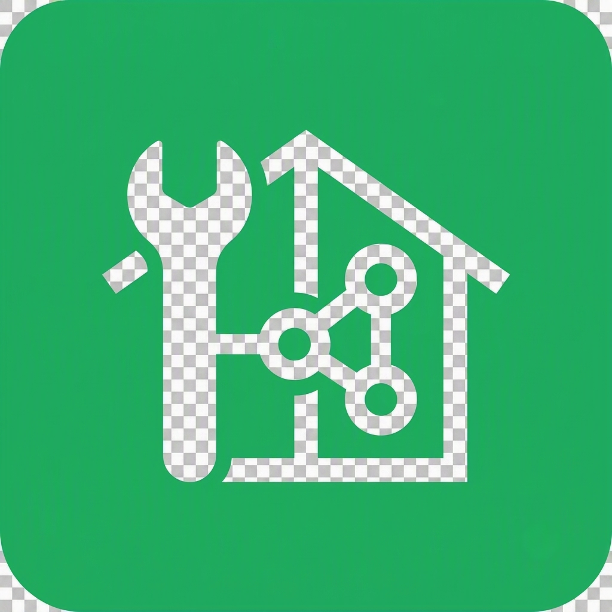

<div align="center">



### The Artemis Cluster

_... where YAML is law, Renovate never sleeps, and 2am <br>is just debugging hours._

</div>

<div align="center">

[](https://talos.dev)&nbsp;&nbsp;
[](https://kubernetes.io)&nbsp;&nbsp;
[](https://fluxcd.io)&nbsp;&nbsp;
[](https://git.dcunha.io/exikle/Artemis-Cluster)

</div>

<div align="center">

[](https://status.dcunha.io)&nbsp;&nbsp;
[](https://status.dcunha.io)&nbsp;&nbsp;
[](https://status.dcunha.io)

</div>

<div align="center">

[](https://github.com/home-operations/kromgo)&nbsp;&nbsp;
[](https://github.com/home-operations/kromgo)&nbsp;&nbsp;
[](https://github.com/home-operations/kromgo)&nbsp;&nbsp;
[](https://github.com/home-operations/kromgo)&nbsp;&nbsp;
[](https://github.com/home-operations/kromgo)&nbsp;&nbsp;
[](https://github.com/home-operations/kromgo)&nbsp;&nbsp;
[](https://github.com/home-operations/kromgo)

</div>

---

## 📖 Overview

Artemis is my homelab Kubernetes cluster, built on [Talos Linux](https://www.talos.dev/) and managed entirely through Git. Three bare-metal control planes, three VM workers (one with a GPU), all reconciled automatically by [Flux CD](https://fluxcd.io/) — push to main, it shows up in the cluster.

---

## ⛵ Kubernetes

### Directories

```sh
📁 kubernetes
├── 📁 apps
│   ├── 📁 arcade                        # Arcade games — eco, Minecraft
│   ├── 📁 cert-manager                  # Automated TLS certificates via Let's Encrypt
│   ├── 📁 cnpg-system                   # CloudNativePG operator
│   ├── 📁 cortex                        # AI stack — litellm proxy/MCP, memini, SearXNG
│   ├── 📁 database                      # Dragonfly operator + PostgreSQL
│   ├── 📁 default                       # Personal apps — Immich (photos), Komga (comics), xBrowserSync
│   ├── 📁 dragonfly-system              # Dragonfly operator
│   ├── 📁 external-endpoints            # ExternalName services bridging off-cluster resources into the mesh
│   ├── 📁 external-secrets              # 1Password-backed ExternalSecret operator for all cluster secrets
│   ├── 📁 fediverse                     # Fediverse — apoci
│   ├── 📁 flux-system                   # Flux Operator, FluxInstance, and GitOps sync entrypoint
│   ├── 📁 forgejo                       # Forgejo + runners + Tekton runners
│   ├── 📁 home-automation               # Home Assistant, ESPHome, Homebridge, Matter Server, Mosquitto, Node-RED, Zigbee
│   ├── 📁 kopiur-system                 # Kopiur
│   ├── 📁 kube-system                   # Cilium (CNI/BGP), CoreDNS, Multus, Intel GPU driver, cluster utilities
│   ├── 📁 media                         # Arr stack, Jellyfin, SABnzbd, qBittorrent+Gluetun, Prowlarr, Bazarr, and more
│   ├── 📁 network                       # Envoy Gateway ingress, ExternalDNS (Cloudflare + UniFi), Cloudflare Tunnel
│   ├── 📁 observability                 # Prometheus, Grafana, VictoriaLogs, Fluent Bit, Gatus, Kromgo, smartctl, unpoller
│   ├── 📁 rook-ceph                     # Distributed block storage across 3 OSD nodes (one per control plane)
│   ├── 📁 security                      # LLDAP, Pocket-ID OIDC provider for cluster-wide SSO, TinyAuth
│   ├── 📁 system-upgrade                # Tuppr — automated Talos and Kubernetes version upgrades
│   └── 📁 tekton-system                 # Tekton operator
├── 📁 components     # Reusable Kustomize components (volsync, etc.)
└── 📁 flux           # Flux sync entrypoint → kubernetes/apps
```

---

## 🔧 Hardware

| Device                                     | Count | Disk                                          | RAM        | OS            | Purpose                                                 |
| ------------------------------------------ | ----- | --------------------------------------------- | ---------- | ------------- | ------------------------------------------------------- |
| Lenovo M710q (`talos-cp-01/02/03`)         | 3     | 256GB NVMe (boot) + 256GB SATA SSD (Ceph OSD) | 16GB       | Talos Linux   | Kubernetes Control Plane                                |
| Proxmox VM on `pantheon` (`talos-w-01/02`) | 2     | Virtualized                                   | 32GB       | Talos Linux   | Kubernetes Worker                                       |
| Proxmox VM on `pantheon` (`talos-gpu-01`)  | 1     | Virtualized                                   | 32GB       | Talos Linux   | Kubernetes GPU Worker (ASRock Arc A380 6GB passthrough) |
| Gigabyte C246N-WU2 (`ymir`)                | 1     | 128GB SATA M.2 SSD                            | 16GB       | Talos Linux   | Kubernetes Worker (Xeon E-2124G, UHD P630 iGPU)         |
| HPE ML150 G9 (`pantheon`)                  | 1     | T-FORCE 1TB SSD                               | 192GB      | Proxmox       | Virtualization Host                                     |
| Supermicro (`atlas`)                       | 1     | 3× RAIDZ2 6-wide (~41TB usable)               | 94.3GB ECC | TrueNAS SCALE | NAS / Media Storage                                     |

---

## 🌐 Networking

| Device                  | Role                                                        |
| ----------------------- | ----------------------------------------------------------- |
| UniFi Cloud Gateway Max | WAN/NAT, L3 gateway, DHCP, BGP (FRR), DNS, UniFi controller |
| Mikrotik CRS309-1G-8S+  | L2 switch only — downstream of UCG-Max on VLAN 1099 (LAB)   |
| UniFi US-48 PoE 500W    | L2 switch (upstream: UCG-Max)                               |
| UniFi US-16 PoE 150W    | L2 switch (upstream: US-48)                                 |

---

## 🤝 Acknowledgments

Thanks to the following for their work and shared knowledge:

- [onedr0p/home-ops](https://github.com/onedr0p/home-ops)
- [bjw-s-labs/home-ops](https://github.com/bjw-s-labs/home-ops)
- [joryirving/home-ops](https://github.com/joryirving/home-ops)
- [Christian Lempa](https://www.youtube.com/@christianlempa)
- [TechnoTim](https://www.youtube.com/@TechnoTim)
- [Home Operations](https://discord.gg/home-operations) Discord community

---

## 📝 License

This repository is available under the WTFPL License. See [LICENSE](./LICENSE) for details.
