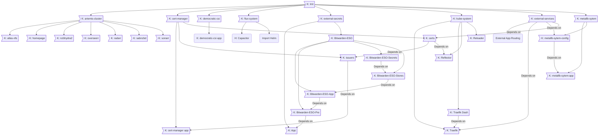

```mermaid

graph TD;

initial>K: Init] -->  k-ac>K: artemis-cluster];
initial>K: Init] -->  k-cm>K: cert-manager];
initial>K: Init] -->  k-dc>K: democratic-csi];
initial>K: Init] -->  k-fs>K: flux-system];
initial>K: Init] -->  k-ext-secrets>K: external-secrets];
initial>K: Init] -->  k-ks>K: kube-system];
initial>K: Init] -->  k-ext-svc>K: external-services];
initial>K: Init] -->  k-ms>K: metallb-sytem];

k-ac>K: artemis-cluster] -->  k-atlas-nfs>K: atlas-nfs];
k-ac>K: artemis-cluster] -->  k-homepage>K: homepage];
k-ac>K: artemis-cluster] -->  k-nzbhydra2>K: nzbhydra2];
k-ac>K: artemis-cluster] -->  k-overseerr>K: overseerr];
k-ac>K: artemis-cluster] -->  k-radarr>K: radarr];
k-ac>K: artemis-cluster] -->  k-sabnzbd>K: sabnzbd];
k-ac>K: artemis-cluster] -->  k-sonarr>K: sonarr];

k-cm>K: cert-manager] ------->  k-cm-app>K: cert-manager app];
k-cm>K: cert-manager] -->  k-cm-issuers>K: issuers];

k-cm>K: cert-manager] -->  k-cm-certs>K: cert-manager certs];
k-cm-issuers>K: issuers] --> |Depends on| k-cm-app>K: cert-manager app]
k-cm-certs>K: certs] --> |Depends on| k-cm-issuers>K: issuers]
k-cm-certs>K: certs] --> |Depends on| k-ks-reflector>K: Reflector]

k-dc>K: democratic-csi] -->  k-dc-zfs-iscsi(K: democratic-csi app);

k-ext-secrets>K: external-secrets] -->  k-ext-secrets-app>K: App];
k-ext-secrets>K: external-secrets] -->  k-ext-secrets-bw>K: Bitwarden-ESO];

k-ext-secrets-bw>K: Bitwarden-ESO] -->  k-ext-secrets-bw-app>K: Bitwarden-ESO-App];
k-ext-secrets-bw>K: Bitwarden-ESO] -->  k-ext-secrets-bw-pre>K: Bitwarden-ESO-Pre];
k-ext-secrets-bw>K: Bitwarden-ESO] -->  k-ext-secrets-bw-secrets>K: Bitwarden-ESO-Secrets];
k-ext-secrets-bw>K: Bitwarden-ESO] -->  k-ext-secrets-bw-stores>K: Bitwarden-ESO-Stores];

k-ext-secrets-bw-pre>K: Bitwarden-ESO-Pre] --> |Depends on| k-ext-secrets-app>K: App]
k-ext-secrets-bw-app>K: Bitwarden-ESO-App] --> |Depends on| k-ext-secrets-bw-pre>K: Bitwarden-ESO-Pre]
k-ext-secrets-bw-secrets>K: Bitwarden-ESO-Secrets] --> |Depends on| k-ext-secrets-bw-stores>K: Bitwarden-ESO-Stores]
k-ext-secrets-bw-stores>K: Bitwarden-ESO-Stores] --> |Depends on| k-ext-secrets-bw-app>K: Bitwarden-ESO-App]

k-ext-svc>K: external-services] -->  external(External App Routing);
k-ext-svc>K: external-services] --> |Depends on| k-ks-traefik>K: Traefik]
k-ext-svc>K: external-services] --> |Depends on| k-ms-config>K: metallb-sytem-config]
k-ext-svc>K: external-services] --> |Depends on| k-cm-certs>K: certs]

k-fs>K: flux-system] -->  k-fs-capacitor(H: Capacitor);
k-fs>K: flux-system] -->  helm(Import Helm)

k-ks>K: kube-system] ------->  k-ks-traefik>K: Traefik]
k-ks>K: kube-system] -->  k-ks-traefik-dash>K: Traefik Dash]
k-ks>K: kube-system] -->  k-ks-reflector>K: Reflector]
k-ks>K: kube-system] -->  k-ks-reloader>K: Reloader]

k-ks-traefik-dash>K: Traefik Dash] --> |Depends on| k-ks-traefik>K: Traefik]

k-ms>K: metallb-sytem] --> k-ms-app>K: metallb-sytem-app]
k-ms>K: metallb-sytem] --> k-ms-config>K: metallb-sytem-config]

k-ms-config>K: metallb-sytem-config] ---> |Depends on| k-ms-app>K: metallb-sytem-app];
```
